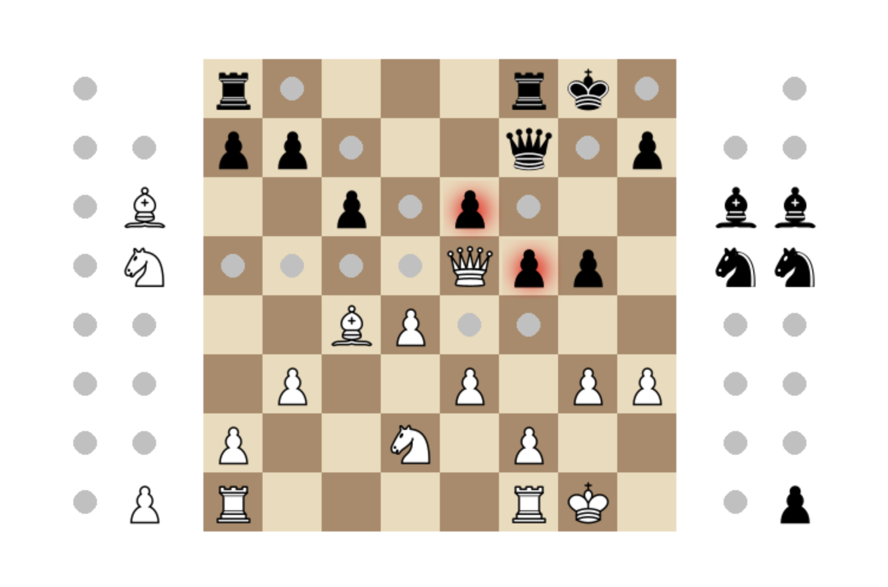
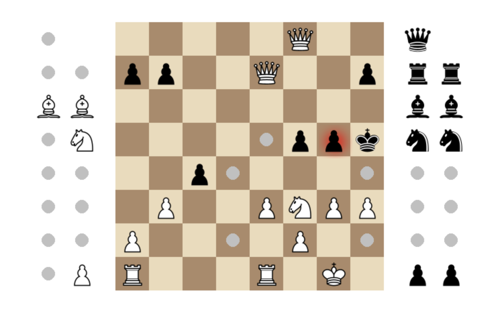
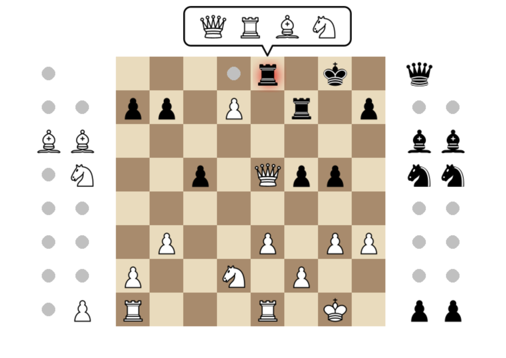
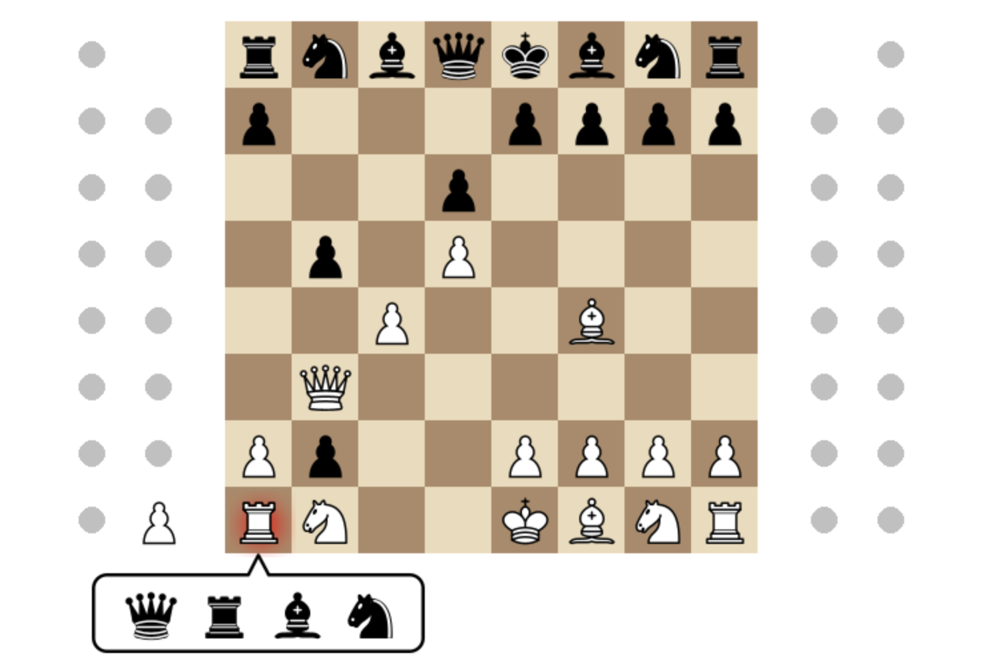
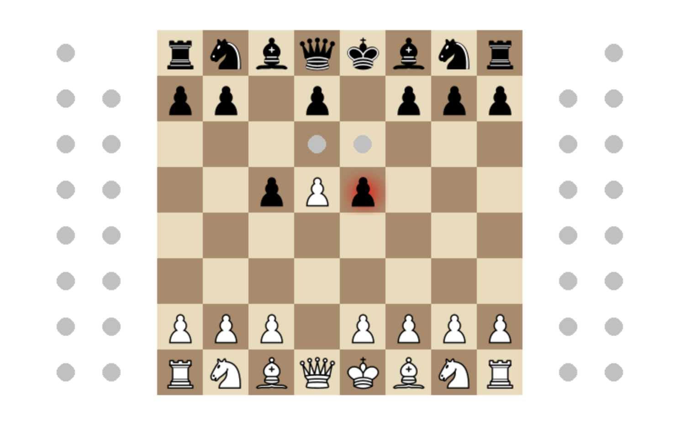

# Chess - Borys Banaszkiewicz

## Description and Features
This Chess application fully implements all chess rules and focuses on helping players visualize the board and game 
state by providing visuals for legal moves, legal captures, and captured pieces.

 - **Captured Pieces**: Tracked and displayed on the screen, providing a visual representation of the game state. The
left side shows all white pieces captured by the black pieces, and the right side shows all black pieces captured by the 
white pieces.
 - **Legal Moves and Captures**: Any piece that is selected by the player will display the legal moves that can be made 
by the selected piece by showing grey circles for each legal move. A red glow signifies a legal capture that can be made
 - **Pawn Promotion**: A selection box with the pieces that a pawn can promote to is displayed above (or below) the 
square that the pawn is promoting to.
 - **Check and Checkmate Conditions**: The game continuosly checks for conditions such as check, checkmate, and 
stalemate to ensure that no illegal moves are allowed
 - **Special Moves**: Moves such as castling and en passant are tracked to ensure these are shown as legal moves only 
when certain conditions are met
 - **Move Log**: The game logs every move made during the game, including special moves like pawn promotion, en passant 
and castling. The implementation of valid chess notation allows for a player to undo any number of moves to return to
any previous state of the game dynamically without having to save or store previous states.
 - **Undo Feature**: An undo feature allows a player to undo any number of moves, allowing player to return to the start
of the game if they choose to. This effectively provides a way to correct mistakes or rethink strategies.
 - **Game Components**: All game pieces, such as Pawns, Rooks, Knights, Bishops, Queens, and Kings, are represented by 
individual classes. Each piece class includes methods to calculate legal moves and captures based on the current state 
of the board

Below are some screenshots of gameplay to show main functionality and GUI.

### Legal moves and legal captures
White Queen legal moves being empty spaces on the board or opposing players pieces (legal captures)

White Knight legal moves being empty spaces on the board or opposing players pieces (legal captures)

### Pawn promotion
When a pawn promotes, a promotion box is displayed so that user can pick the piece they want to promote to

### Blocking check against pinned king
There is a forced move that needs to be made by the Black Queen or Black Rook to block the active check against the king.
Since the king cannot move due to being pinned, the only legal move showing is the square that the Black Queen or Black 
Rook can move to block the attack

### En passant
Since the black pawn that is in front of the king moved 2 squares forward, the white pawn can capture the black pawn via
an en passant, or it can progress forward without capturing.
